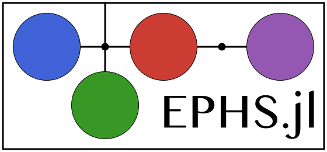

# EPHS.jl

Towards a minimal implementation of the EPHS modeling language.

Ingredients:
- interfaces based on directories
- symbolic language to express equations
- discrete-time components
- (filled) interconnection patterns and graphical representation
- compiler: system -> discrete-time evolution equations
- compiler: discrete-time evolution equations -> Julia function(s) for simulation

Imposed limitations to simplify the first prototype:
- state spaces of ports are ℝ
- only power ports
- no (kinematic/algebraic) constraints
- no environment components
